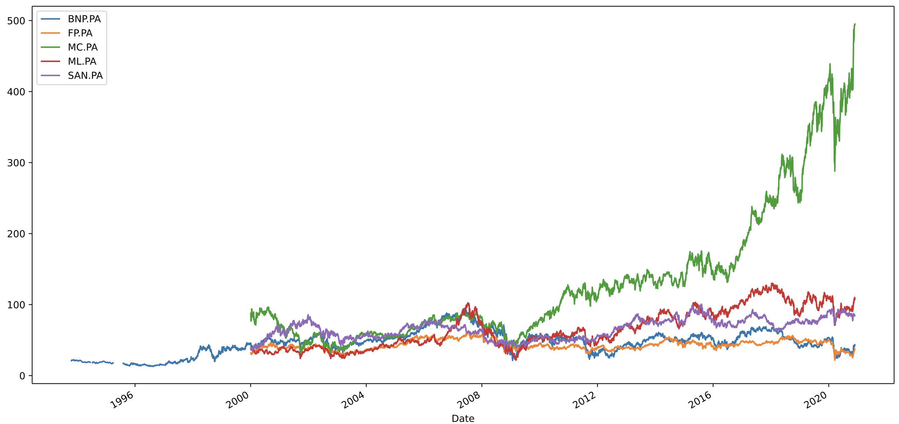

# Méthode de récupération des données
### Introduction
Pour ce projet d'apprentissage par renforcement, nous allons nous baser sur les données issues de Yahoo Finances, pour 5 actions différentes :
- Total (FP)
- Sanofi (SAN)
- BNP Paribas (BNP)
- LVMH (MC)
- Michelin (ML)
Ces actions ont été choisies pour leur ancienneté sur le CAC40 : elles ont toutes été cotées à la création de l'indice, le 31 octobre 1987.

Nous travaillerons sur les prix de fermetures des actions (Close) par jour.
Ce cadre de travail nous est imposé par la limite de la récupération des données de Yahoo Finance dans un cadre gratuit. En effet, sans compte payant, il est impossible de récupérer des données "intraday" sur une période supérieure à 60 jours.

### Récupération des données
#### Librairies
```python
import yfinance as yf
import pandas as pd
import matplotlib.pyplot as plt
import os
```

#### Données
```python
dataset = yf.download(tickers = ["FP.PA", "SAN.PA", "BNP.PA", "MC.PA", "ML.PA")
```
En laissant les autres paramètres par défauts, nous spécifions à la fonction que nous souhaitons les données pour toute la période où des données sont disponibles. 
Évidemment, ces paramètres peuvent être modifiés en fonction de ce que l'on souhaite (lien vers la documentation en fin de page).

```python
# - Limitation au prix de clôture
dataset.columns # Format MultiIndex de Pandas
dataset = dataset["Close"]
```

```python
# - Changer le noms des colonnes
dataset.rename(columns={"FP.PA":"Total", 
                        "SAN.PA":"Sanofi",
                        "BNP.PA" : "BNP", 
                        "MC.PA":"LVMH", 
                        "ML.PA":"Michelin"})
```

On vient donc de renommer les colonnes, pour une meilleure lisibilité, et de sélectionner exclusivement le prix de clôture des actions.

#### Graphique
```python
dataset.plot(figsize = (16,8))
```


On voit qu'il est préférable de filtrer nos données à la date du 03/01/2000 pour avoir le prix pour toutes les actions par jour. 

```python
dataset = dataset.loc[dataset.index >= '2000-01-03T00:00:00.000']
```

### Crédits
- Documentation : https://github.com/ranaroussi/yfinance
- Remerciement : Ran Aroussi, créateur de la librarie Python "yfinance".
