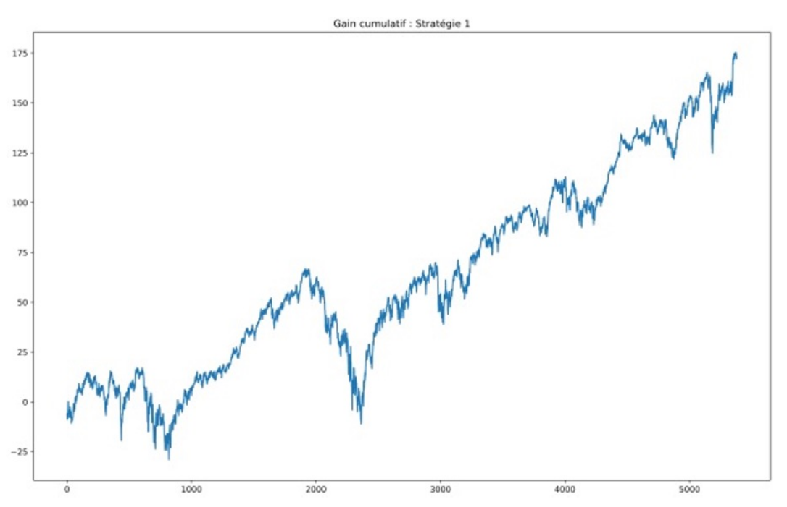
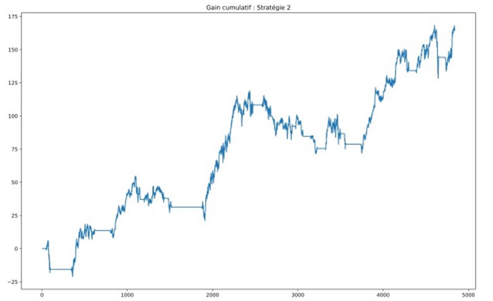
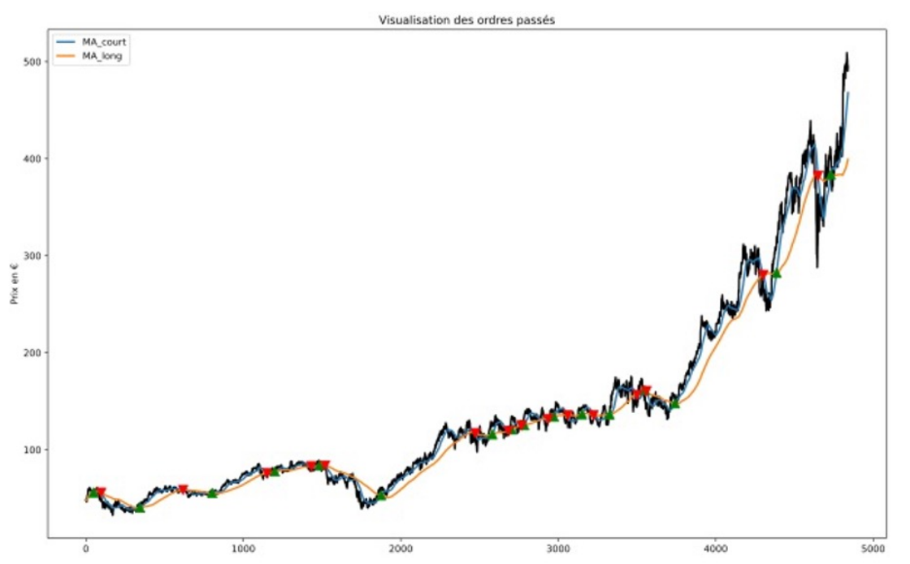
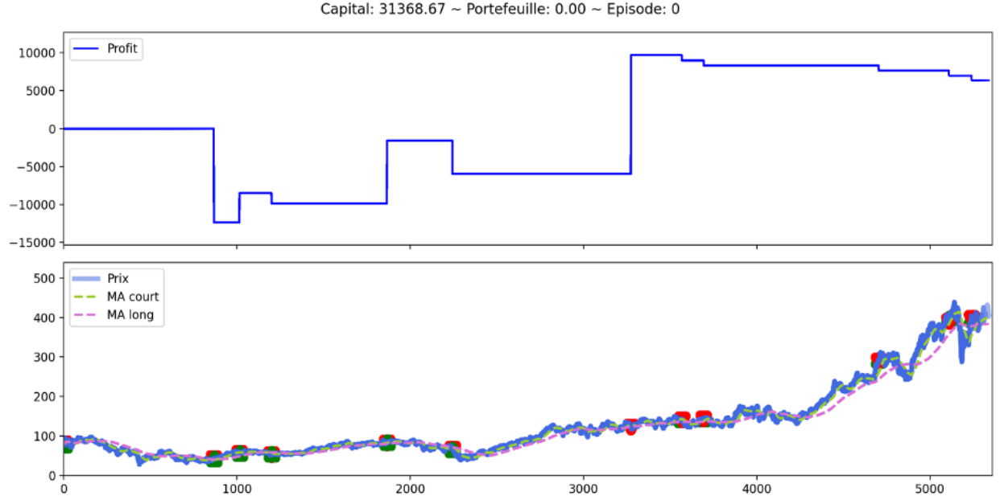
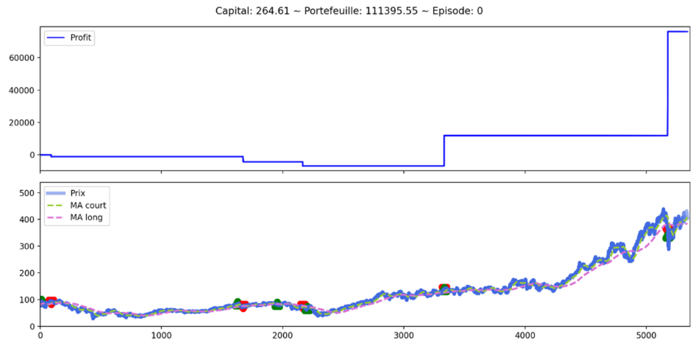
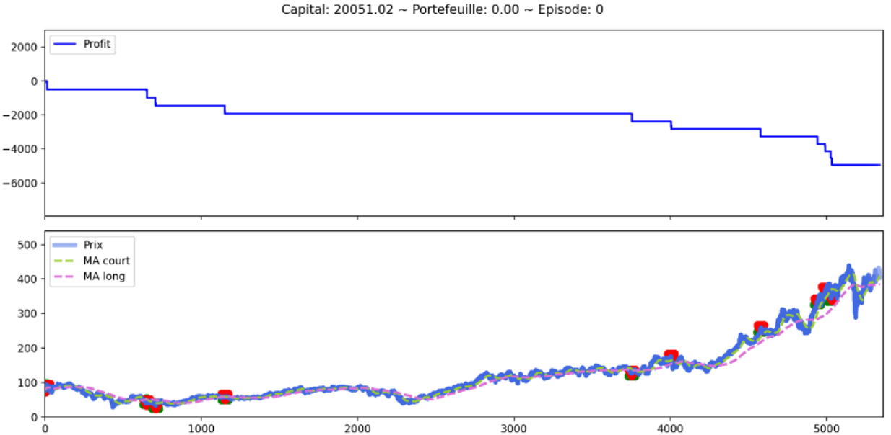

# Reinforcement Learning Course - Master 2 APE / DS2E
Ce repo contient notre projet pour le cours d'Apprentissage par renforcement. 
Ce projet s'intéresse à l'utilisation de différentes techniques d'apprentissage par renforcement dans le cadre d'une application au trading de cours boursiers. 
Vous y trouverez tout le matériel nécessaire à l'exécution du projet avec les données utilisées et les différents scripts Python.
  
## Dépendances 
- Tqdm
- Yfinance
- Pandas
- Numpy
- Gym
- Keras
- Matplotlib

## Données
Pour ce projet d'apprentissage par renforcement, nous allons nous baser sur les données issues de Yahoo Finances, pour 5 actions différentes :
- Total (FP)
- Sanofi (SAN)
- BNP Paribas (BNP)
- LVMH (MC)
- Michelin (ML)

Ces actions ont été choisies pour leur ancienneté sur le CAC40 : elles ont toutes été cotées à la création de l'indice, le 31 octobre 1987.
Nous travaillerons sur les prix de fermetures des actions (Close) par jour.

## Méthodologie
### Définitions des stratégies
 On va étudier la pertinance de stratégies basées sur l'apprentissage par renforcement en les comparants à des stratégies financières simples :

  1 - Stratégie de marché : 
    Dans cette stratégie, l'agent va acheter un panier d'actions, à parts égales, pour se constituer un portefeuille dont les performances copieront exactement les mouvements du marché. 

  2 - Cross Moving Average : 
    Ici, l'agent possèdera deux indicateurs financiers : une moyenne mobile courte et une longue.
    Il va se donc s'en servir pour identifier les signaux d'achat et de vente. Le principe est très simple puisque lorsque la moyenne mobile la plus courte devient supérieure à la moyenne mobile la plus longue, alors l'agent achète. À l'inverse, c'est un signal de vente. 
  
  3 - Deep-Q Learning :
    Dans cette stratégie, l’agent dispose de trois actions : achat, attendre, action
    et de deux indicateurs financiers : moyenne mobile courte et moyenne mobile longue. La différence principale avec la stratégie CMA est qu’il ne sait pas que ces deux indicateurs peuvent lui fournir des signaux d’achats et de ventes. 
    L’intérêt de lui fournir ces indicateurs est donc de voir si l’agent est capable d’en tirer une information et si oui, à quel point est-elle proche de l’intuition fournie par la méthode CMA. Ici encore, l’agent devra supporter les coûts des commissions pour les passages d’ordres, mais aussi celui de l’opportunité. En effet, nous introduisons dans cette stratégie un coût d’opportunité que l’agent va supporter et qui re ètera son inaction lorsqu’il ne possèdera pas d’actions dans son portefeuille. À noter que ce coût peut aussi devenir une récompense dans le cas où le cours de l’action baisse et que l’agent n’en possédait pas. 
    En fonction de ces informations fournies par l’environnement et du gain qui découle à l’instant t, l’agent va chercher à prendre la meilleure décision pour le moment suivant. Pour cela, il sera aidé par un réseau de neurones qui l’aidera à prédire l’action la plus pertinente en approximant les valeurs de la table Q.

## Précisions méthodologique
Dans cette partie, vous trouverez les résultats de chacune des stratégies citées plus haut.
Plusieurs informations sont à noter :
- Tous nos agents disposent d’un capital de départ de 25.000
- La commission lors des passages d’ordre est fixée à 1% de la valeur de la transaction
- Moyenne mobile courte : 50j
- Moyenne mobile longue : 200j

## Résultats
### Stratégie 1 : Stratégie de marché
Ici, l’agent s’est constitué un panier de 5 actions présentées en début de rapport. Voici les performances de cette méthode qui nous servira de stratégie de base pour faire nos comparaisons.
Dans cette configuration, notre agent réalise un pro t net de 51889.76€ sur la période.

### Stratégie 2 : Stratégie cross-moving average (CMA)
Dans cette stratégie, l’agent à identi er que l’action la plus volatile sur les deux premières années était l’action LVMH. Ensuite, il va appliquer la stratégie pour essayer de tirer pro t de cette volatilité.
Avec cette stratégie, notre agent surpasse les performances du marché et réalise un profit net de 64184.37€, malgré la présence d’une commission de 1%.
Voici les résultats :

### Stratégie 3 : Deep Q-Learning
Cette stratégie, étant très différente des deux précédentes, nécessite de s’y attarder plus longuement et de voir l’impact de certaines variables sur le pro t de notre agent avant de déterminer les valeurs qui lui permettront d’obtenir le pro t maximal.
Premièrement, nous allons nous intéresser à la variable « gamma » qui représente le facteur d’actualisation. Voici les résultats pour différentes valeurs de gamma testées :
#### Gamma = 0.2

#### Gamma = 0.5

#### Gamma = 0.8

A noter, ces éléments graphiques s'affichent automatiquement lors de l'entraînement de l'agent, de manière dynamique.

Avec ces différents graphiques, nous voyons qu’en termes de pro t, un taux d’actualisation égal à
0.5 est notre meilleure solution pour maximiser le pro t de l’agent puisqu’il réalise un béné ce de
plus de 75.000€ sur la période. C’est donc cette valeur que nous gardons.
Ensuite, nous nous sommes intéressés à la variable « learning rate », correspond au facteur
d’apprentissage du réseau de neurones de notre agent. Plus il est élevé, plus notre agent va avoir
tendance à considérer uniquement la dernière information qu’il a apprise plutôt que les anciennes. À
noter que ne nous ne sommes pas dans un environnement déterministe et qu’une valeur très
grande peut empêcher l’agent de converger. Nous avons donc considéré plusieurs valeurs : 0.001,
0.003 et 0.005. Les résultats montrent que l’agent maximise ses gains avec un taux d’apprentissage
égal à 0.003.

Pour terminer, il faut aussi noter que les résultats peuvent différer si le temps d'entraînement n'est pas assez long, notamment à cause de l'aspect aléatoire de la selection des premières actions de l'agent. Cependant, à long terme, il devrait converger.

## Informations
  - Université : Université de Strasbourg - FSEG
  - Cours : Apprentissage par renforcement
  - Professeur : M. Bertrand KOEBEL
  - Étudiants : BRUNIQUET Mathis, JOLY Valentin

